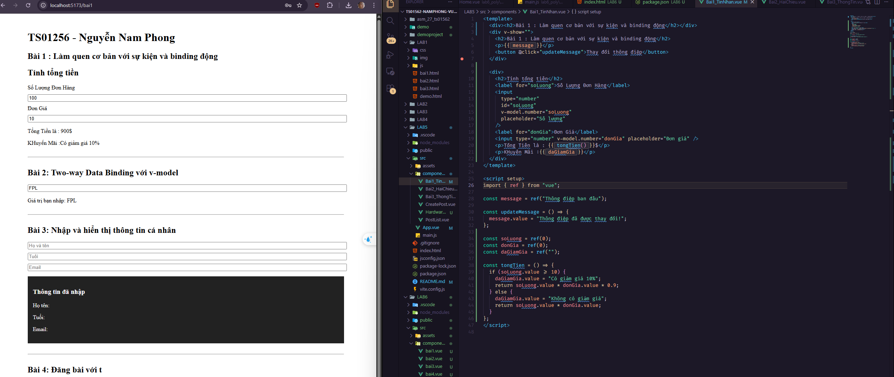
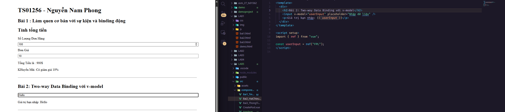
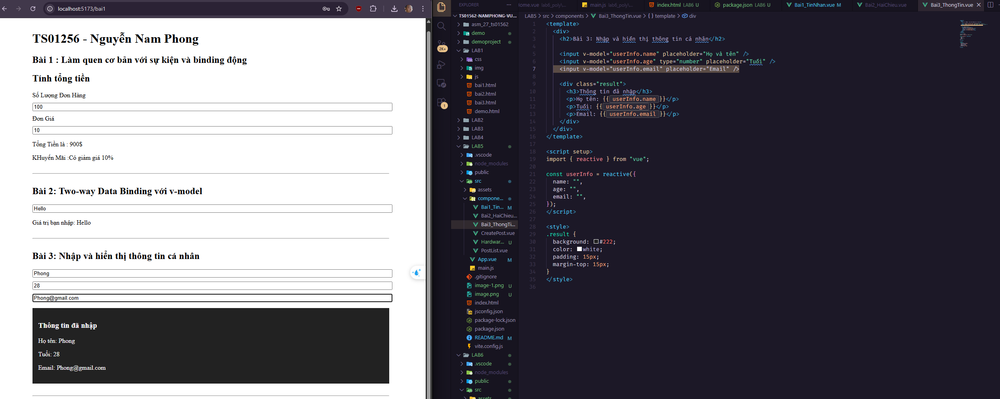
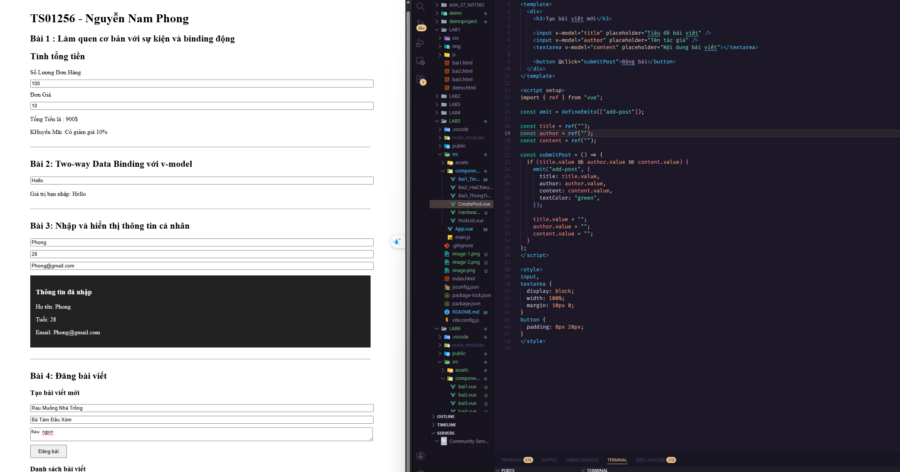
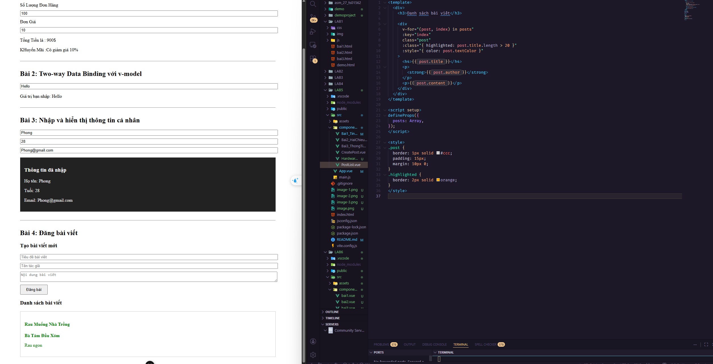

LAB5 - 27 - TS01562

Bài 1 : Làm quen cơ bản với sự kiện và binding động Tạo một nút bấm (button) và khi bấm vào nút, hiển thị một thông báo được cập nhật.
Yêu cầu:
-Tạo một biến message với giá trị mặc định.
-Khi bấm nút, giá trị của message sẽ được thay đổi thành một thông điệp mới.

Bài 2: Two-way Data Binding với v-model
Tạo một input nhập vào giá trị bất kỳ và hiển thị giá trị của trường nhập liệu đó ngay bên dưới theo thời gian thực.
Yêu cầu:
-Sử dụng v-model để binding giá trị từ input đến biến userInput.
-Hiển thị giá trị của biến userInput dưới thẻ 
.

Bài 3 : Nhập và hiển thị thông tin cá nhân
Tạo một form nhập vào các trường thông tin bao gồm: Họ và tên, Tuổi, Địa chỉ Email.
Yêu cầu:
-Sử dụng v-model để liên kết dữ liệu giữa các input fields và các biến reactive trong Vue.
-Hiển thị trực tiếp những thay đổi khi người dùng nhập thông tin vào form.

Bài 4: Xây dựng ứng dụng tạo và hiển thị danh sách bài viết gồm các
yêu cầu sau:
-Tạo bài đăng blog mới (tiêu đề, tác giả, nội dung).
-Hiển thị danh sách các bài viết đã đăng.
-Cho phép thay đổi màu sắc, kiểu dáng của mỗi bài viết thông qua việc sử dụng class
binding và inline style binding.

