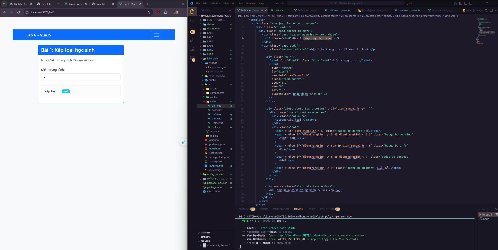
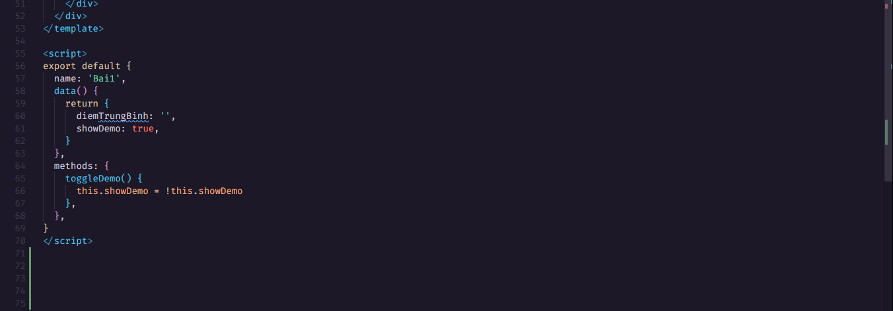
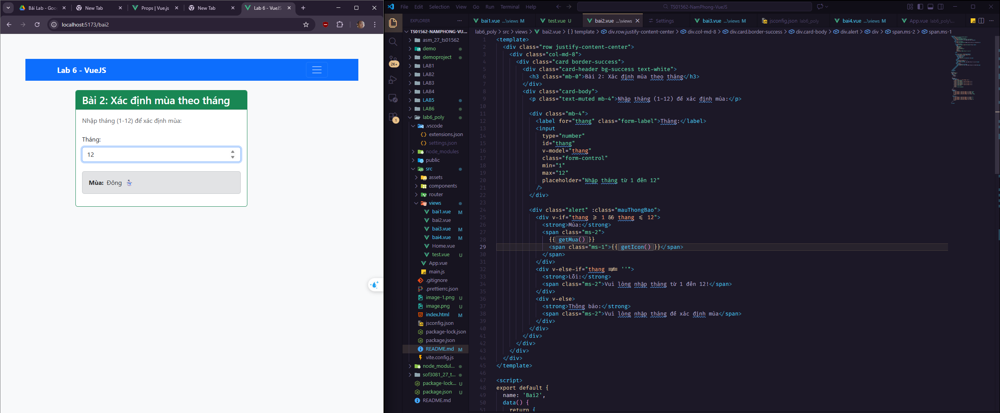
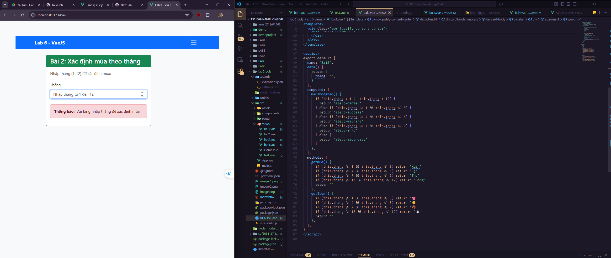
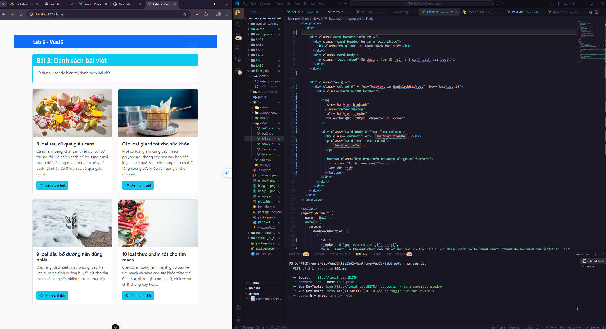
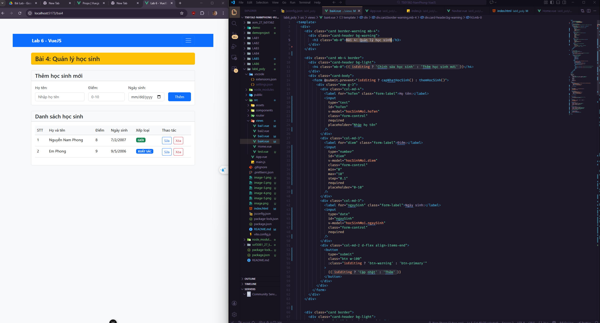
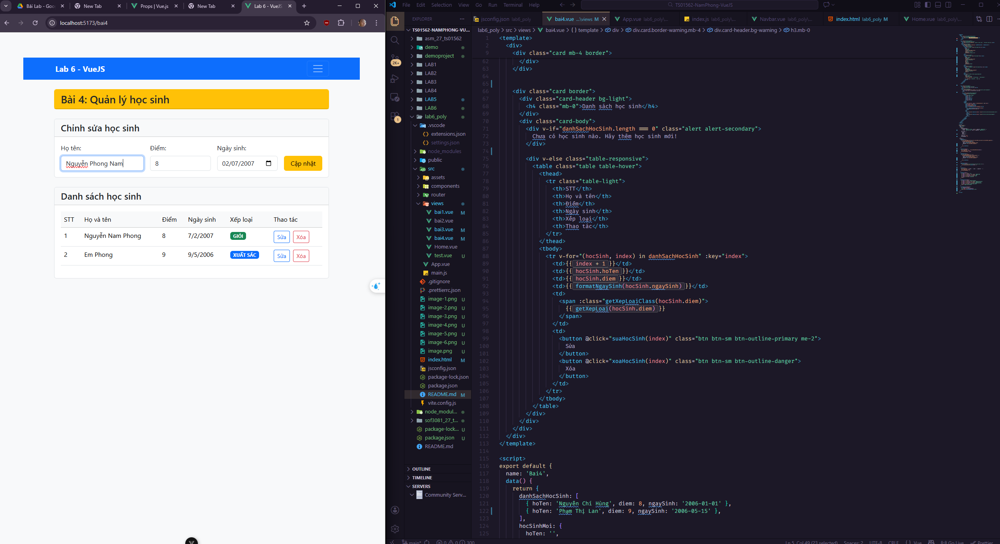
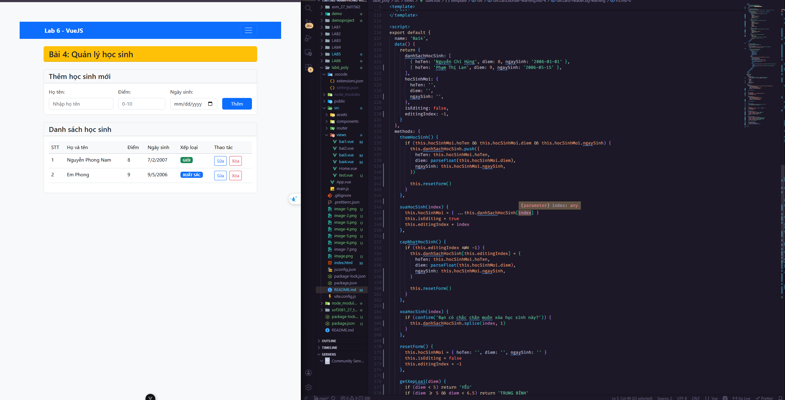
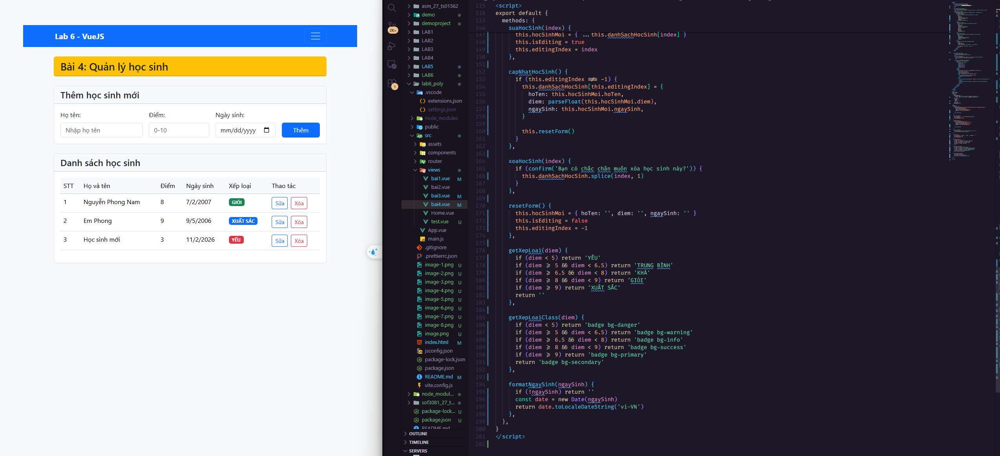

LAB6 - 27 -  Nguyễn Nam Phong

Bài 1: Nhập vào điểm trung bình của học sinh và in ra xếp loại tương ứng. 
Yêu cầu:
Nếu ĐTB < 5.0 thì xếp loại yếu
Nếu 5.0 ≤ ĐTB < 6.5 thì xếp loại trung bình
Nếu 6.5 ≤ ĐTB < 8.0 thì xếp loại khá
Nếu ĐTB 8.0 ≤ ĐTB < 9 thì xếp loại giỏi.
Nếu ĐTB ≥ 9.0 thì xếp loại xuất sắc.

Bài 2 : Viết chương trình nhập một tháng bất kỳ và in ra mùa tương ứng.
Yêu cầu:
Sử dụng v-if, v-else-if...
Tháng < 1 hoặc >12 thì in ra thông điệp "Vui lòng nhập tháng từ 1 đến 12!"

Bài 3 : Hiển thị danh sách thông tin bài viết gồm hình ảnh, tiêu đề, nội dung mô tả như hình dưới đây. 
Yêu cầu:
Thay thế cách hiển thị danh sách bài viết bằng cách sử dụng v-for

![alt text]images/(image-5.png)

Bài 4 : Xây dựng các chức năng CRUD cho quản lý học sinh với các trường Họ tên, Điểm, Ngày sinh. 
Yêu cầu:
Tạo Form: Phần này cho phép thêm hoặc sửa thông tin học sinh. Khi nhấn nút "Thêm", dữ liệu mới sẽ được thêm vào danh sách. Nếu đang trong chế độ chỉnh sửa,
nút "Cập nhật" (thay cho nút Thêm) sẽ hiển thị và học sinh tương ứng sẽ được cập nhật.
Danh sách: Danh sách hiển thị các học sinh đã được thêm vào. Bạn có thể chỉnh sửa hoặc xóa từng học sinh từ danh sách này.
Có thể sử dụng sự kiện @submit.prevent thay vì @click ngăn chặn hành vi tải lại trang web khi người dùng bấm 'Thêm'

