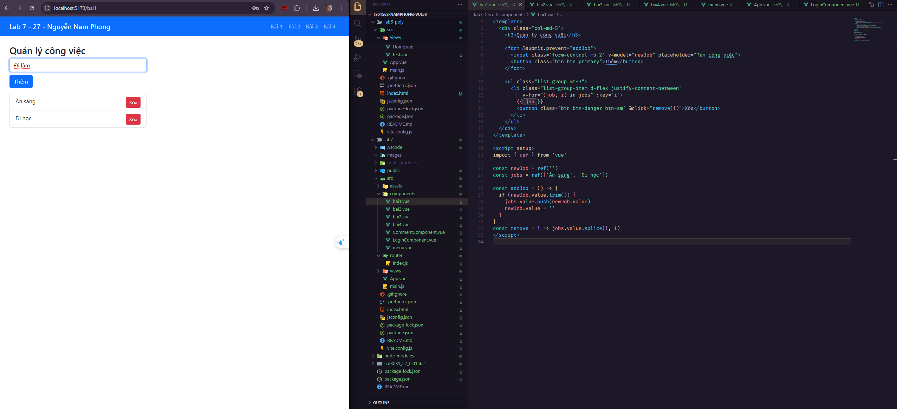
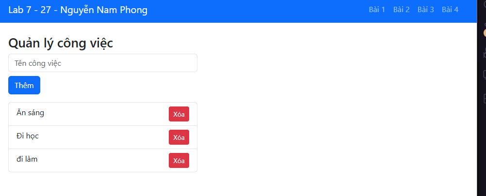
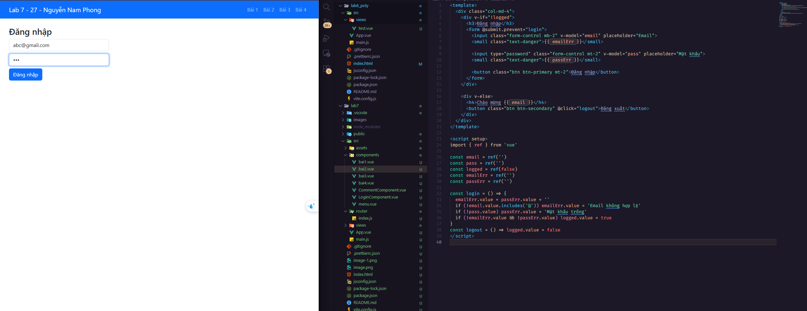
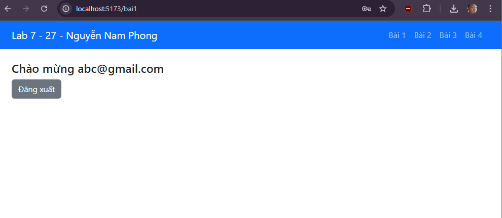
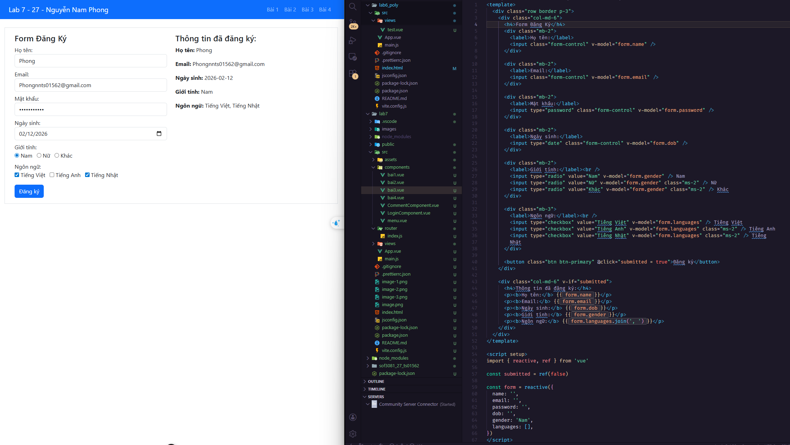
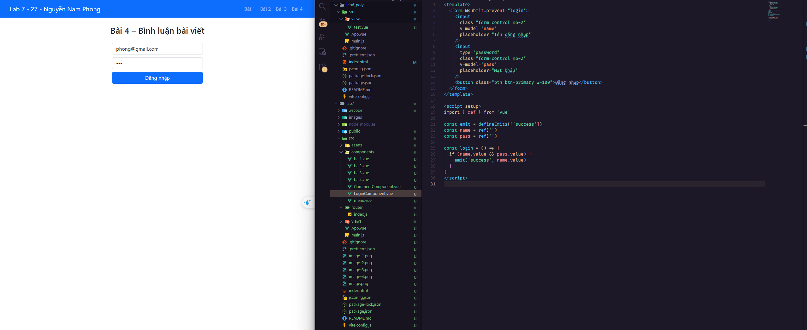
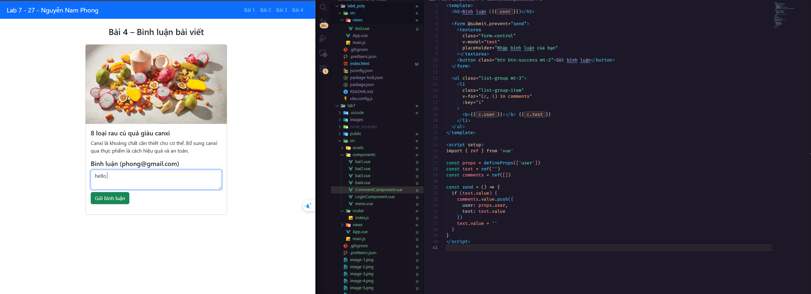
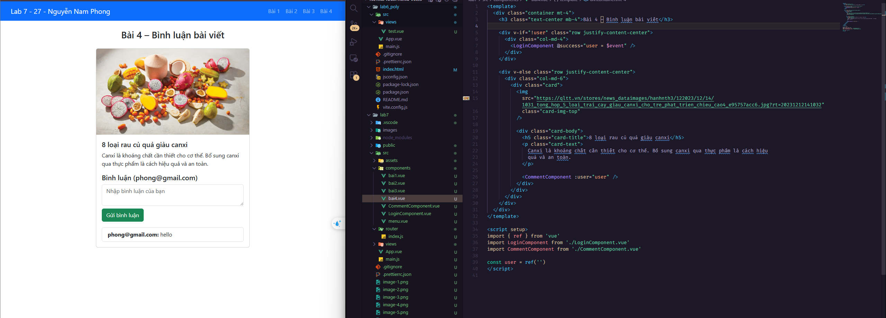

LAB7 - 27 - Nguyễn Nam Phong

Bài 1 : Tạo ứng dụng quản lý công việc. 
Yêu cầu:
-Tạo form thêm mới một công việc
-Hiển thị danh sách các công việc, có nút Xóa công việc 
-Có thể sử dụng sự kiện @submit.prevent thay vì @click ngăn chặn hành vi tải lại trang web khi người dùng bấm 'Thêm công việc

Bài 2 (3 điểm): Tạo một Form đăng nhập gồm email và mật khẩu
Yêu cầu:
-Form Validation: Sử dụng v-if kiểm tra hợp lệ khi người dùng bỏ trống hoặc nhập sai
định dạng email/mật khẩu
-Khi người dùng đăng nhập thành công, hiển thị Chào mừng và xử lý thêm chức năng
Đăng xuất. Khi bấm Đăng xuất hiển thị lại giao diện Form Đăng nhập
-Sự kiện click trên nút Đăng nhập: Trong Vue.js, khi sử dụng nút bên trong form, sự
kiện submit mặc định của form sẽ được kích hoạt. Điều này có thể làm trang web tải
lại, do đó bạn cần ngăn chặn hành vi mặc định này bằng @submit.prevent thay vì
@click

Bài 3 : Tạo form đăng ký người dùng. 
Yêu cầu như sau:
-Có các trường: Họ tên, email, Mật khẩu, Ngày sinh, Giới tính, Ngôn ngữ
-Cho phép người dùng nhấn vào nút Đăng ký.
-Hiển thị các thông tin đã đăng ký (trừ Mật khẩu).
-Ứng dụng bài học về phần Binding đơn giản

Bài 4 : Tạo ứng dụng bình luận bài viết. 
Yêu cầu gồm 3 component:
-Component Đăng nhập: Chứa form đăng nhập với tên và mật khẩu.
-Component Bình Luận: Cho phép người dùng đã đăng nhập bình luận bài viết.
-Component Chính (Bai4.vue): Điều khiển logic hiển thị và luân chuyển giữa các component
-Ứng dụng kiến thức Cơ chế giao tiếp giữa các component thông qua props và emit

